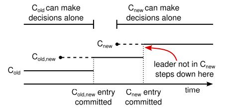

# Raft协议

Raft和Paxos协议一样，是解决分布式系统一致性的共识协议。Raft比Paxos更易理解，它将共识协议中的关键元素分开，包括leader选举、日志复制和安全等。相比于其它协议，Raft具有以下几个显著特性：

- Strong leader
  
  Raft对leader的职责更明确和严格，例如日志条目只能从leader发向其它server，这简化了日志的管理，也使Raft更容易理解

- Leader选举
  
  Raft利用随机定时器机制来选举Leader，这个机制只在所有共识协议都要用到的心跳基础上增加少量改动，快速巧妙地解决唯一Leader的问题

- 成员关系维护
  
  Raft利用一种叫联合共识(joint consensus)的方法来实现一组server间成员变更的问题，这种方法要求在成员关系变更过程中，两个不同配置的server组成员的大多数是重叠的，它使系统在配置变更期间仍能正常工作

## 1. 复制状态机

复制向量机常用来解决分布式系统中的容错问题，在这种方法中，运行在一组server上的向量机能从一致的状态拷贝中计算出相同的结果，并且当一些server宕机后整个系统仍能正常工作。共识协议一般都基于复制向量机工作。

复制状态机由两部分组成：日志和状态机。日志用于记录一系列指令，这些指令按顺序存储，状态机按顺序执行这些指令。一组复制状态机的日志是完全相同的-相同的指令按相同的次序存储，而状态机又是确定性的-相同的初始状态、相同的输入下产生相同的输出，所以一组复制状态机最后能产生完全一致的结果。

如何保证所有状态机日志的一致性，是一致性算法的关键任务。

## 2. Raft算法

### 2.1 基本概念

- Follower
  
  节点的初始状态，Follower是被动的，它不能主动发起请求，只能被动响应其它角色发过来的请求。节点在非选举的正常工作阶段，要么是Leader，要么是Follower。

- Candidate
  
  参与选举Leader的节点为Candidate。Follower一段时间没有收到任何请求会自动进入Candidate状态，该状态可以尝试发起选举成为Leader，另外如果在该状态下收到了Leader的请求，会自动变为Follower。

- Leader
  
  处理所有来自客户端的请求，一个集群只能有一个Leader。Leader一旦当选，在宕机前会一直保持Leader状态，但是如果发现了更高级别的Leader，会自动变为Follower。

- 任期(Term)
  
  每一轮选举为一个任期，任期用连续的数字表示，每个任期的开始都是一次选举。如果一个Candidate赢得多数选票成为Leader，其Leader角色会一直持续，直到它宕机，开始下一个任期。

  每个节点都会保存当前的任期数，任期数只会单调增加。任期在Raft中充当逻辑时钟的角色，并允许服务器检测过期信息。节点进行通信时会交换任期号，自动更新为较大的任期号，如果是Candidate或Leader意识到它的任期过期了，会立即转变到Follower状态，如果节点收到请求的任期号是过期的，他会拒绝此次请求。

Raft集群的节点之间存在2种RPC调用：

- RequestVote RPC: 用于Candidate角色发起投票请求。只有当Candidate的日志的任期号和index都比当前节点新时，当前节点才会将选票投给他，并且每个节点只有1次投票权

- AppendEntries RPC: 用于Leader节点向其它节点同步日志。如果该RPC不包含日志，则作为心跳来维持自身的Leader地位

### 2.2 Leader选举

Raft使用随机定时器机制选举Leader，使用心跳机制维持Leader身份。

Leader会周期性向集群内所有服务器发送心跳信息，以维持Leader身份。当follower在一个周期内未收到任何心跳信息，则它认为没有可用的Leader，并开始一次选举以选出新的Leader。

为了开始选举，Follower会自增当前任期并转换到Candidate状态，他会给自己投票并给集群中所有其他服务器发送投票请求，要求把选票投给自己。一个Candidate会一直处于该状态，直至下列三种情形之一发生：

- 它获得的多数选票，赢得选举
  
- 收到另一台服务器的心跳信息(另一台服务器赢得选举)
  
- 选举周期结束后仍未获得大多数选票

下面分情况分别讨论

1. 赢得选举
   
   当一个Candidate赢得多数选票后，即赢得选举。
   
   投票规则：先到先服务原则，一台服务器只有一次投票权，发起投票的Candidate投给自己

   一个Candidate只有赢得多数选票后才能成为Leader，保证了Leader的唯一性。

2. 收到另一台服务器的心跳信息
   
   意味着等待投票时，其它服务器赢得选举，需要切换为Follower状态。但是Candidate会校验心跳信息中的任期值，如果比当前任期低，则拒绝该消息并维持Candidate状态。

3. 选举周期结束后仍未获得大多数选票
   
   表示有多个Candidate同时发起选举并瓜分了选票。此时每个Candidate选举都会超时，并自增任期号发起新一轮选举。如果没有新的手段分配选票的话，这种状态可能会无限重复下去。

   Raft使用随机选举超时时间来避免这种情况的发生，这样各个服务器发起选举的时刻会分散开来，减小了选票被平均瓜分的可能性。

### 2.3 日志复制

Leader会接收来自客户端的请求，每个请求都是一条可以被状态机执行的命令(日志)。Leader会将这条日志追加到日志末尾，并向其它服务器同步(AppendEntries RPC)。当一条条目被安全的复制后，Leader会将这条日志应用到状态机中(提交)并向客户端返回计算结果。Leader会无限重试AppendEtries RPC直到所有Follower都存储了所有日志条目。

每条日志包含如下几个元素：

- 从客户端接收到的命令本身

- 这条命令被Leader接收到时的任期号

- 索引，表示该条命令在全局日志中的位置

当一条日志被成功复制到**大多数**服务器上时，Leader就会将它标记为已提交。所有已提交日志之前的日志也都是已提交的，包括由之前的Leader创建的日志。Leader跟踪当前最后一条已提交日志的索引值，并且这个索引值会包含在之后所有的AppendEtries RPC和心跳中，为的是让其它服务器都知道这个条目已提交。一旦Follower知道了一个日志条目是已提交的，它就会将该日志应用到本机的状态机执行。

日志中的索引号和任期值的重要作用是用于日志一致性检查。当Leader发送AppendEtries RPC用于向其它服务器同步新日志时，会把新日志条目的上一条日志的索引I和任期号T都包含在消息里面。Follower会在其日志中找到跟索引I和任期号T相匹配的日志，之后的日志都会被Leader的日志覆盖；如果Follower没有找到跟索引I和任期号T相匹配的日志，则拒绝这个日志条目并返回失败。

日志一致性检查保证了**日志匹配原则**：

- 如果2个复制状态机的日志中，2个条目有着相同的索引和任期号，则它们存储的命令是相同的
  
  这是因为Leader在一个任期里，在同一个索引位置只会创建一条日志条目，一旦创建就不可变更(提交持久化)

- 如果2个复制状态机的日志中，2个条目有着相同的索引和任期号，则它们之前的所有日志条目都是完全一样的
  
  这源于日志一致性检查：一开始空的日志肯定满足日志匹配原则，一致性检查保证了日志添加时的也是满足日志匹配原则的。因此只要AppendEntries RPC返回成功，Leader就知道该Follower的日志跟它是匹配的了。

虽然大部分情况下Leader和Follower的日志都是一致的，但是由于异常宕机、网络时延等故障，日志不一致无法避免，因此需要有日志冲突的恢复机制。

Raft算法通过**强制复制**来处理Follower跟Leader日志不一致的场景。为使得Follower日志和自己一致，Leader需要找到Follower跟它日志一致的地方，然后删除Follower在该位置之后的所有条目，并将该位置之后的所有日志同步给Follower。

Leader为每个Follower维护一个nextIndex来跟踪每个Follower日志同步的状态，nextIndex表示Leader将要发送给该Follower下一条日志的索引。

当Leader开始掌权时，会将nextIndex初始化为它最新的日志条目的索引+1。当Follower的日志跟Leader不一致时，AppendEntries RPC会返回失败，此时Leader会将nextIndex递减并重试AppendEntries RPC直至返回成功。此时nextIndex位于Follower和Leader日志一致的地方，Follower之后的日志条目被移除，并且开始复制Leader的日志条目。

### 2.4 选举限制

Raft是强Leader一致性算法，日志流向只能从Leader流向Follower，因此必须保证选举出来的Leader包含了所有已提交的日志条目。

Raft的投票机制可以避免一个没有包含全部日志的Candidate赢得选举。RequestVote RPC包含了Candidate的日志信息，如果当前服务器的日志比Candidate的要新，则会拒绝Candidate的投票请求。

由于一条日志必须成功复制到大多数服务器上才能成功提交，因此获得了大多数服务器投票的Candidate一定包含了最新的提交日志。

Raft通过比较2个server最后一条日志的任期号和索引来决定哪一条日志更新：首先比较任期号，如果任期号相同，则索引号大的日志新。

## 3. 集群配置变更

到目前为止，我们的讨论都是基于集群配置不变的情况。有些情况下需要变更集群配置，比如向集群中增加或减少服务器，或者把一些服务器从一个集群迁移到另一个集群。一种简单的方法是先将集群离线，做完配置变更后再重启集群，但是这样会增加不可用时间。因此我们需要为Raft增加自动配置变更的功能。

为了安全的进行配置变更，必须保证变更过程中不能同时出现2个Leader。由于变更不可能在同一时刻完成，必须是渐进的，所以在某一时刻可能出现2个成员不同的分立的集群C_new和C_old，进而同时出现2个Leader。

为避免这种情况，Raft引入名叫**联合共识**(Joint Consensus)的中间转换状态，实际是一个两阶段提交：进行配置变更时，首先进入联合共识状态，将包含新老配置的所有服务器组合成一个集群，该状态提交后进入新配置的状态并最终提交。

联合共识状态下：

- 日志被复制到包含新老配置的所有服务器中

- 新配置和老配置的成员都可用被选举为Leader

- 联合共识状态的成员，必须同时包含新配置的大多数和老配置的大多数成员

联合共识状态可以保证服务器在不同时间安全的从一个配置迁移到另一个配置，并且在迁移过程中集群仍然能正常处理客户端命令。

### 3.1 配置变更流程

配置信息也是通过日志的形式在集群内扩散的，下图是配置变更的过程：

1. 联合共识状态
   
   Leader收到配置变更请求后，生成联合共识的配置日志(C_old, C_new)，该配置同时包含C_old和C_new的所有服务器（至少同时包含2者的大多数服务器），这条日志像普通日志一样通过AppendEntries RPC发送到配置(C_old, C_new)中的所有服务器。

   配置日志的特殊之处在于，一旦任何服务器收到这条日志，日志中的配置就会立即生效，不管这条日志提交与否。这也意味着，Leader会以配置(C_old, C_new)中的服务器数量作为基数来决定是否提交这条日志。

2. 新配置状态
   
   Leader收到配置(C_old, C_new)中大多数服务器的响应后，就会提交这条日志。此时就能安全的创建只含C_new的配置并扩散到相关服务器了，当C_new提交后，老配置中与C_new无关的服务器就被从集群中移除了。

### 3.2 配置变更过程中的issue分析

1. 新加入集群的server热启动
   
   新加入集群的server，日志跟当前集群相差比较大，日志同步需要花一段时间。Raft增加了一个状态，在该状态下server没有选举权和被选举权，但是可以正常从Leader同步日志。

2. Leader被新配置剔除
   
   如果当前Leader被从新配置中剔除，那么当C_new提交后，Leader会马上进入Follower状态，并重新从新配置中选举一个Leader。

   但从C_new日志生成到C_new提交这段时间，当前Leader虽然是集群的管理者，但是却不是集群的成员，它行使Leader的职责，但是在判断大多数时不会将自己计入集群的服务器基数。

3. 消除被新配置移除的其它server的干扰
   
   新配置C_new提交后，这些被新配置移除的服务器不再收到Leader的心跳，超时后会开始新一轮选举。他们会自增任期号并向C_old配置的所有服务器发送RequestVote RPC，这会导致C_new集群的Leader自动切换到Follower，因为RequestVote RPC中的任期号更大。最终Leader会从C_new配置中产生，但由于被移除的服务器仍然收不到心跳，这个过程会一直持续，从而影响新集群的可用性。

   为了消除这一影响，考虑为每个服务器增加最小选举超时时间，只有在该时间内未收到Leader的心跳，才能响应RequestVote RPC请求，否则直接拒绝。

