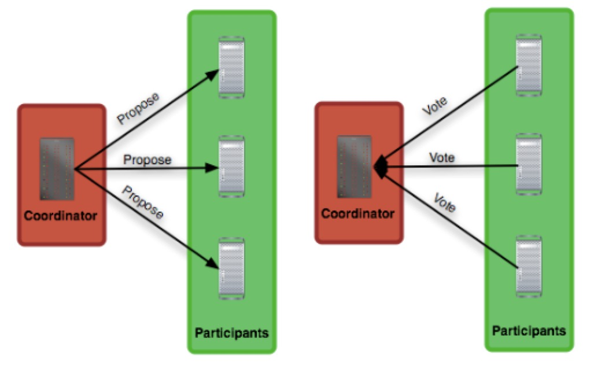
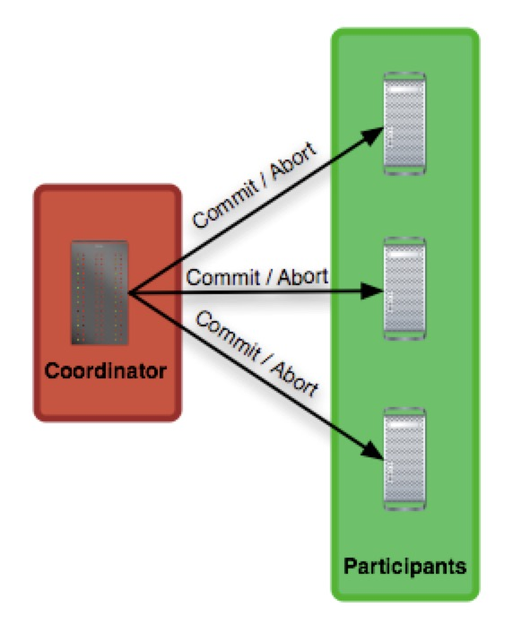

传统的数据库只能保证单个数据库数据修改的事务性，而在分布式系统中，为保证数据高可用和系统吞吐量，数据通常被分片和复制，存储在不同的物理机器上的不同数据库中，如何同步修改位于不同物理机器上的数据，是一个严峻的挑战。

解决分布式一致性问题比较著名的协议有2阶段提交(2PC, 2 Phase Commit)，3阶段提交(3PC，3 Phase Commit)和Paxo协议。

# 2PC

2阶段提交和3阶段提交都引入了事务协调者(XA Manager)的角色，对参与分布式事务的节点(XA Resource)的提交过程进行管理，保证事务的原子性(所有节点要么全做，要么全不做)。

1. 第一阶段：提交请求(vote)
   
   

   XA Manager向所有的XA Resource发起提交请求，XA Resource收到请求后获取相关资源，**执行事务操作**，并根据处理结果进行投票，向XA Manager发送OK或Abort应答。

2. 第二阶段：提交
   
   

   XA Manager收到所有XA Resource的应答后，进行第二阶段的操作。如果所有XA Resource都返回OK，则向所有XA Resource发送提交命令，否则发送回滚命令。XA Resource收到提交或回滚命令后完成提交或回滚并释放整个事务期间占用的资源。XA Manager收到所有XA Resource的提交完成或回滚完成的应答后，结束或取消事务。

2阶段提交的回滚是通过记录undo/redo日志来实现的。

2阶段提交看起来确实能提供原子性操作，但是仍有一些缺点：

- 阻塞
  2阶段提交是阻塞式协议，XA Resource在第一阶段应答完成后，将一直处于阻塞状态，直到收到第二阶段的提交或回滚命令，该状态下一直占用锁资源，也会导致其他需要获取这个锁的进程处于阻塞状态。
- 数据不一致
  在第二阶段执行提交的过程中，如果XA Manager发送提交命令后宕机或者网络故障，导致只有一部分XA Resource接收到提交命令，那么就会有一部分XA Resource无法执行提交，整个分布式系统就出现了数据不一致的现象。
  另外，如果XA Manager发送提交命令后宕机，并且唯一接收到提交命令的XA Resource也宕机，那么即使通过选举产生了新的协调者，这条事务的状态也是不确定的：新的协调者无法确定已经宕机XA Resource是否已经完成提交，如果新的协调者发起提交，但是宕机的XA Resource并没有提交，数据就不一致了，反之亦然。
- 单点故障
  由于XA Manager在整个协议的运行中发挥不可替代的作用，一旦其发生网络故障或宕机，会导致整个协议处于挂死状态，可以通过定时器，或重新选举新的manager来接管协议状态，但是仍然可能存在第二点中数据不一致的问题

# 3PC

在2阶段提交协议中，所有XA Resource节点收到第二阶段的提交命令后，直接提交，而不管其他节点是否能提交成功。这样做的问题就是，如果唯一一个收到提交命令的Resource节点和Manager节点同时宕机，那么无法判断这个事务是否提交成功：如果宕机的节点已经提交成功，那么协议简单的让所有其他节点回滚，数据就不一致了；反之如果协议简单地让其他节点都成功提交，若宕机的节点并未提交成功，数据也会不一致

3PC在一定程度上规避了这个问题，引入超时机制，以及在第二阶段发送提交命令前再加一个阶段：准备提交(prepare to commit)。当manager收到第一阶段的投票结果并确认结果为提交时，向所有节点发送准备提交命令。节点收到准备提交命令后，进入中间状态，在该状态下能够随时进行提交（该阶段不能做无法undo的事情），然后向manager发送成功响应。

添加这个步骤的作用是，所有参与事务的节点进行提交前最后的沟通，当这个步骤成功完成以后，无论哪个非manager节点节点宕机，都不影响协议的恢复。

当Manager节点宕机后，协议将进入恢复模式。在该模式下会产生新的Manager节点，并向任意其它在线的Resource节点查询当前状态。如果已经处于prepare to commit完成状态，那么manager就可以安全的执行第三步提交指令了（如果节点处于prepare to commit状态后一直未收到第三步的指令，超时后默认提交）；如果Resource节点还没到prepare to commit状态，manager则可以确定这个事务还没有提交，可以安全的进行回滚或重试。

在某些特定场景下，三阶段提交协议仍然不能保证数据的一致性。比如在网络分区场景下，所有分区一中的节点都收到prepare to commit指令，而分区二中的所有节点都没有收到第二阶段的准备提交指令，当这2个网络分区各自进入恢复模式后，协议在2个分区的运行结果分别是提交和回滚，网络恢复后数据又处于不一致的状态。

三阶段提交协议的优点在于，任何节点宕机后协议都不会被block。

# Paxos

3PC的容错机制是为fail-stop模型设计的：机器宕机后永远无法恢复。而很多时候，错误大部分是fail-recover模型：因为网络拥塞、或者CPU占用高，导致Manager节点一段时间无法响应，进而导致协议超时。如果Manager在发送prepare to commit后、收到响应前网络故障，协议超时后重新选举了新的Manger，查询其他节点状态得知均处于提交准备完成状态，于是向所有节点发起提交。同时，原来的Manager从网络故障、或CPU忙中恢复，由于协议超时且未收到其他节点的prepare to commit的确认应答，会向所有节点发送回滚命令。如果这2个时间点刚好处于同一时刻，那么哪个消息先到达节点是不确定的，协议的运行结果又一次处于不确定的状态。

